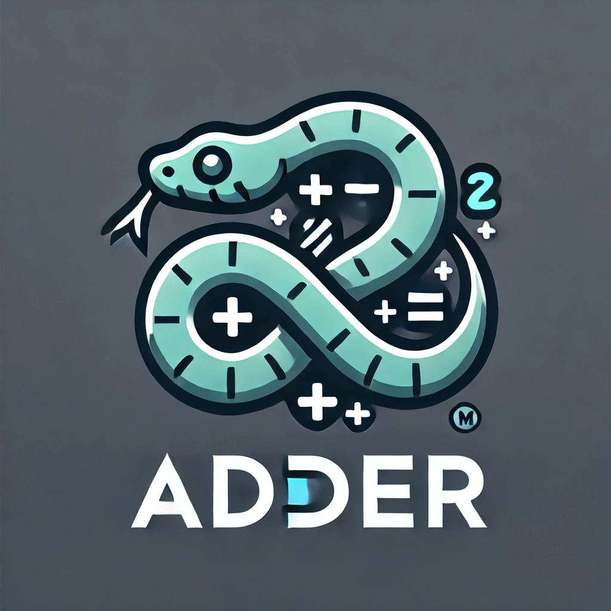
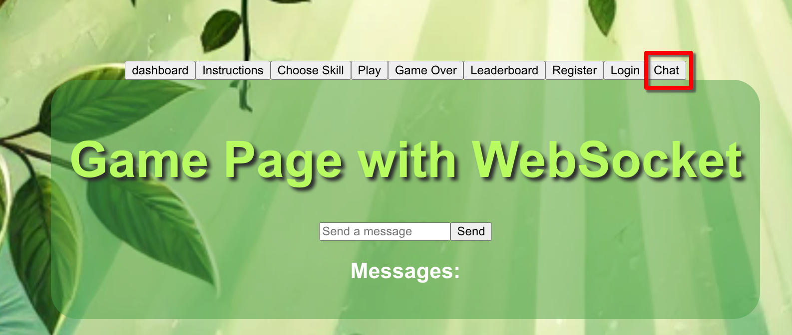
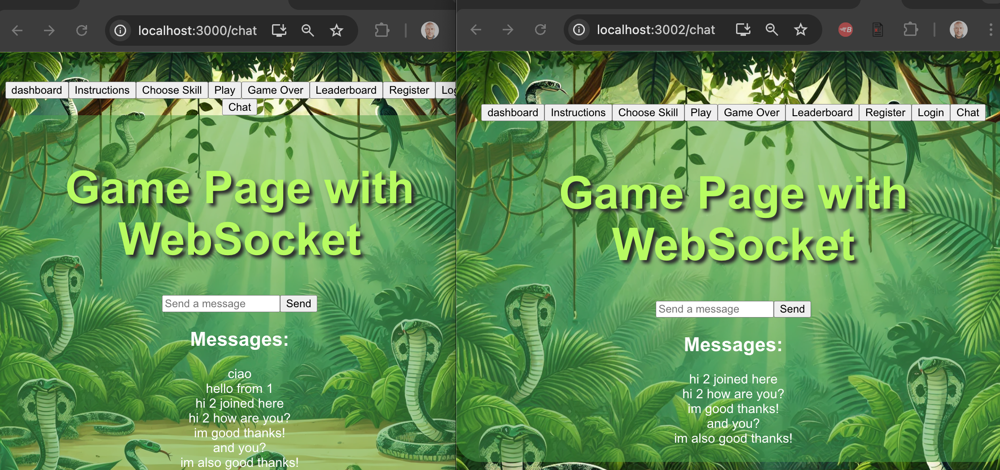
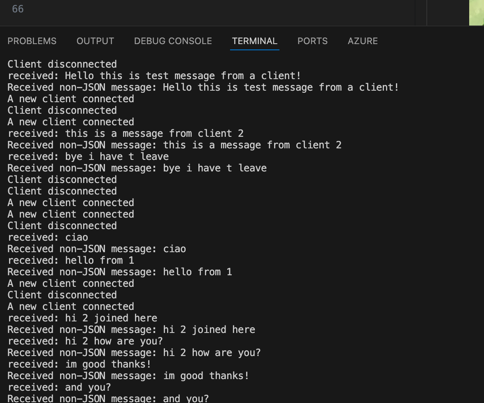

# 🐍 Adder - The Jungle Math Adventure Game

<p>
   
</p>
Welcome to **Adder**, a jungle-inspired multiplayer math game! Get ready to slither through math challenges in a vibrant and adventurous setting. Here’s how you can set up and launch your own instance of Adder.

---

## Getting Started 🚀

### 📋 Prerequisites

Before you start, make sure to have the following installed and set up:
- **Node.js** (latest version)
- **MongoDB** (latest version)
- A MongoDB connection string: `mongodb://127.0.0.1:27017/Adder`

### 📦 Install Dependencies

Navigate to both `frontend` and `backend` directories, then run:
```bash
npm install
```

---

## 🚀 Launching Adder

1. **Frontend**: Start the frontend server by running:
   ```bash
   npm start
   ```
   The frontend will be accessible at [http://localhost:3000](http://localhost:3000).

2. **Backend**: Start the backend server by running:
   ```bash
   npm start
   ```
   The backend will be accessible at [http://localhost:5000](http://localhost:5000).

> Ensure both servers are running for the app to work smoothly!

---

## 🌐 Ports Used

| Service    | Port |
|------------|------|
| Frontend   | 3000 |
| Backend    | 5000 |

---

## Chat capability
To test the chat feature simply click on chat and start chatting with a few clients.








## 🌱 Happy coding, and enjoy slithering through the world of Adder! 🐍🌿
