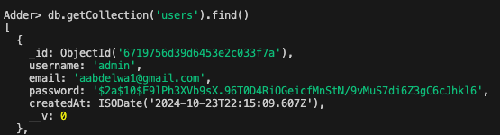

# 🐍 Adder - The Math Adventure Game

<p>
   
</p>
Welcome to **Adder**, a jungle-inspired multiplayer math game! Get ready to slither through math challenges in a vibrant and adventurous setting. Here’s how you can set up and launch your own instance of Adder.

---

## Getting Started 🚀

### 📋 Prerequisites

Before you start, make sure to have the following installed and set up:
- **Node.js** v.22.9.0
- **MongoDB** v.8.0.1
- **Mongo Shell** (https://www.mongodb.com/try/download/shell) `mongosh` 
- A MongoDB connection string: `mongodb://127.0.0.1:27017/Adder`

### Test DB Connection:
 - Make sure MongoDB service is running (depending on your OS: check https://www.mongodb.com/docs/manual/administration/install-community/)

 - Start Mongo Shell and test connection
 
 `mongosh "mongodb://127.0.0.1:27017/Adder"`
 
 Output:

 `Current Mongosh Log ID: 673f509282f61dcf8819f72e`

`Connecting to:          mongodb://127.0.0.1:27017/Adder?directConnection=true&serverSelectionTimeoutMS=2000&appName=mongosh+2.3.2`

`Using MongoDB:          8.0.1`

`Using Mongosh:          2.3.2`

`mongosh 2.3.3 is available for download: https://www.mongodb.com/try/download/shell`

After this you should be able to start querying the MongoDB



### 📦 Install Dependencies

Navigate to both `frontend` and `backend` directories, then run:
```bash
npm install
```

---

## 🚀 Launching Adder

1. **Frontend**: Start the frontend server by running:
   ```bash
   npm run dev
   ```
   The frontend will be accessible at [http://localhost:5173](http://localhost:3000).

2. **Backend**: Start the backend server by running:
   ```bash
   npm start
   ```
   The backend will be accessible at [http://localhost:5000](http://localhost:5000).

> Ensure both servers are running for the app to work smoothly!

---

## 🌐 Ports Used

| Service    | Port |
|------------|------|
| Frontend   | 5173 |
| Backend    | 5000 |

---

## 🌱 Happy coding, and enjoy slithering through the world of Adder! 🐍🌿
