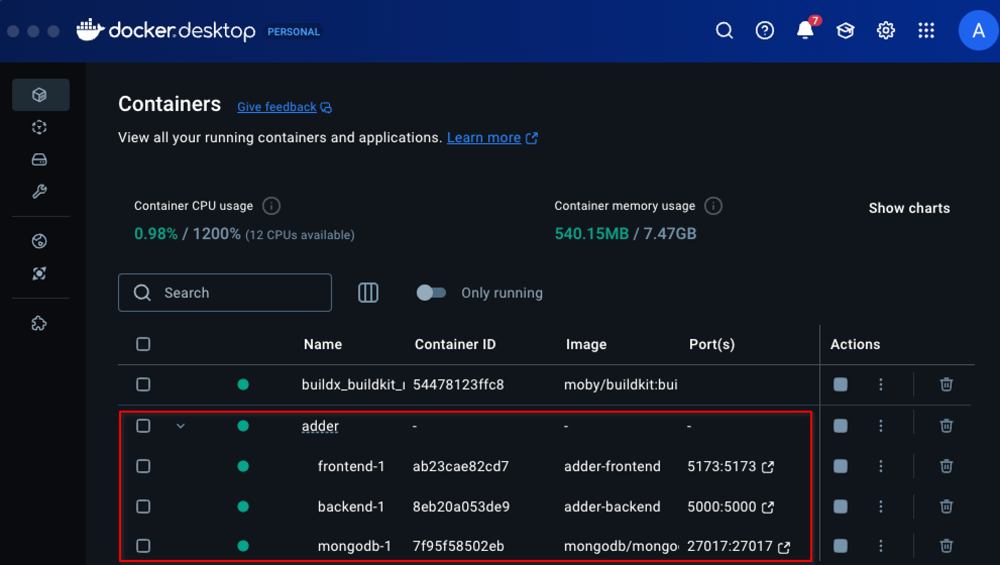
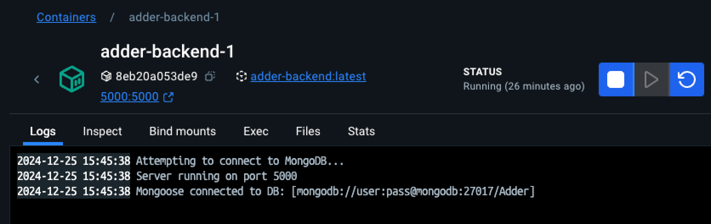
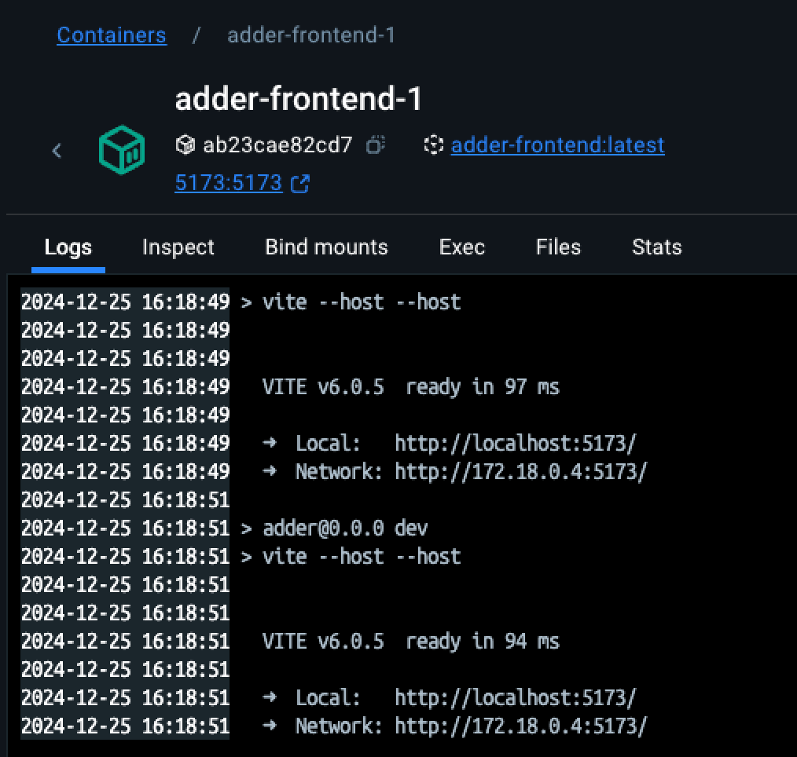
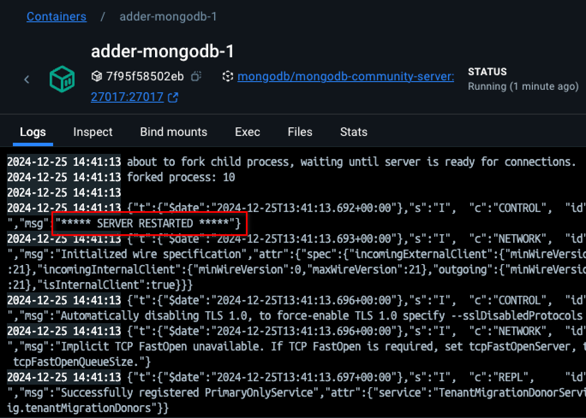
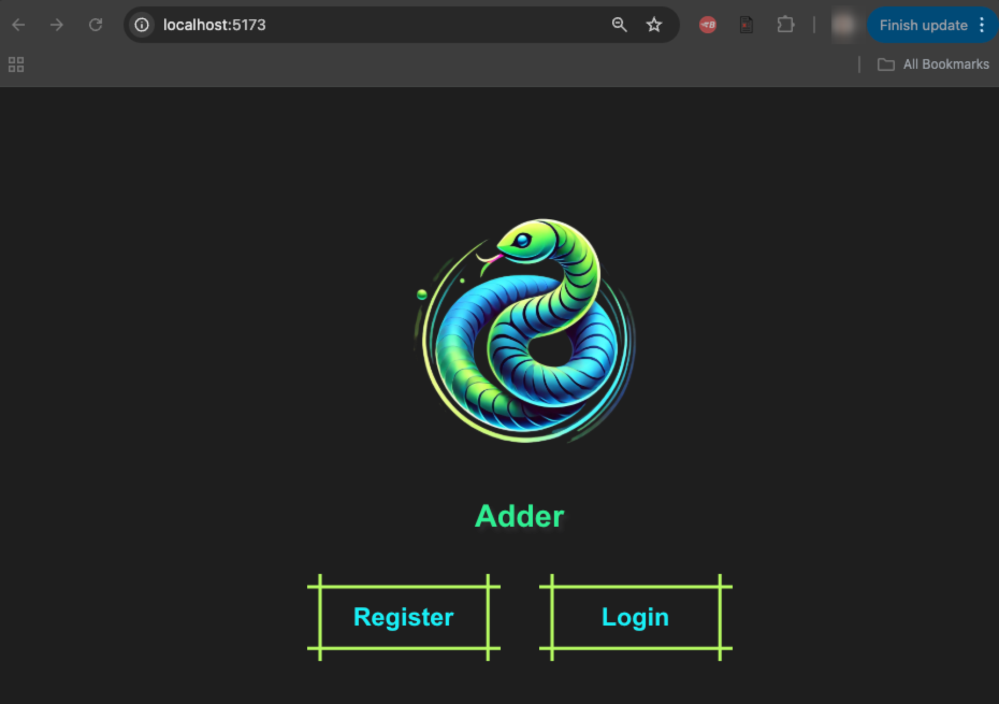
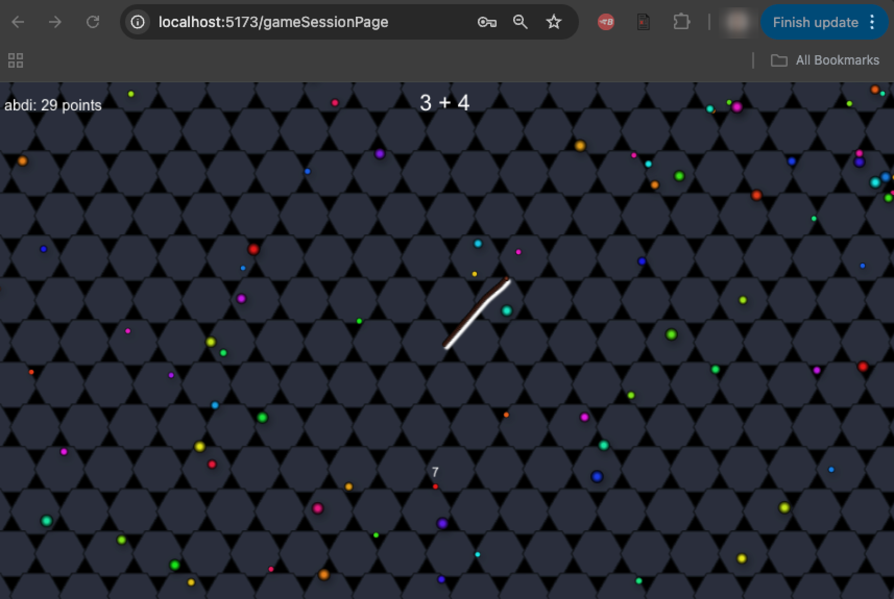

# 🐍 Adder - The Math Adventure Game

<p>
   
</p>
Inspired by the original slither.io, Adder is a multiplayer game built with Node.js and React in which the main goal is to solve math challenges with a slithering snake. Get ready to slither around in a vibrant and adventurous setting.

---

## Getting Started 🚀
Here’s how you can set up and launch your own instance of Adder. This web application has been dockerized to simplify the configuration and initial setup so you can enjoy the game as quick as possible!

### 📋 Prerequisites

Before you start, make sure to have the following items installed and set up:
- **Docker Desktop** v4.37.1
   - Windows: https://docs.docker.com/desktop/setup/install/windows-install/
   - MacOS: https://docs.docker.com/desktop/setup/install/mac-install/
   - Linux: https://docs.docker.com/desktop/setup/install/linux/
   
- **npm** v.11.0.0
- **Node.js** v.22.9.0
- **MongoDB** v.7.0.16
- **Mongo Shell** v.2.3.7
   - (https://www.mongodb.com/try/download/shell)

### 🪄 How to run and Launch Adder with docker-compose 🏆 (recommended)
1. Clone the Adder Repository(main) locally
2. Start your Docker Desktop client and make sure the docker engine is up and running
3. Open your terminal inside your IDE or use a CLI of your choice
4. 🚀 Run the following command:
```bash
docker-compose up --build
```

After this step a compose stack named "adder" containing the backend, frontend and mongodb containers should be up and running on your docker desktop client.

<p>
   
</p>

The logs in each container should show the following:

- Backend:
<p>
   
</p>

- Frontend:
<p>
   
</p>


- MongoDB:
<p>
   
</p>

🕹 To access the frontend to play the game simply follow the url: http://localhost:5173/ or by clicking on the port on the docker contianer shown on the previous print screen.

<p>
   
</p>

<p>
   
</p>

---

## 🚀 Launching Adder without docker-compose (not recommended) 🤹

Alternatively you can run and launch adder locally without docker. Here you need to run the three components backend, frontend and MongoDB separatley through your terminal. Make sure to have the required packeges installed and a working MongoDB instance (service running on port 27017)

1. **Frontend**: Start the frontend server by running:
   ```bash
   npm install
   npm run dev
   ```
   The frontend will be accessible at [http://localhost:5173](http://localhost:3000).

2. **Backend**: Start the backend server by running:
   ```bash
   npm install
   npm start
   ```
   The backend will be accessible at [http://localhost:5000](http://localhost:5000).

2. **MongoDB**: Start the MongoDB server:
After downloading and installing MongoDB the mongodb service should be running on port 27017.

🔴 IMPORTANT :

Make sure to change the connection string in mongoDB.js and set it to `mongodb://127.0.0.1:27017/Adder`

 - Test DB Connection:
 Make sure MongoDB service is running (depending on your OS: check https://www.mongodb.com/docs/manual/administration/install-community/)

 - Start Mongo Shell and test connection
 
 `mongosh "mongodb://127.0.0.1:27017/Adder"`
 
 Output:

 `Current Mongosh Log ID: 673f509282f61dcf8819f72e`

`Connecting to:          mongodb://127.0.0.1:27017/Adder?directConnection=true&serverSelectionTimeoutMS=2000&appName=mongosh+2.3.2`

`Using MongoDB:          8.0.1`

`Using Mongosh:          2.3.2`


✅ Ensure all 3 servers are running for the app to work smoothly!

---

## 🌐 Ports Used

| Service    | Port |
|------------|------|
| Frontend   | 5173 |
| Backend    | 5000 |
| MongoDB    | 27017 |

---

# 🕹 Happy gaming, and enjoy slithering 🐍 through the world of Adder!  🏆
